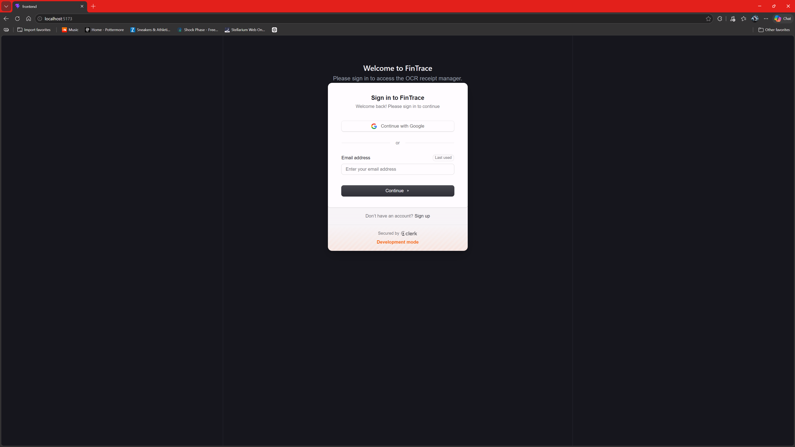
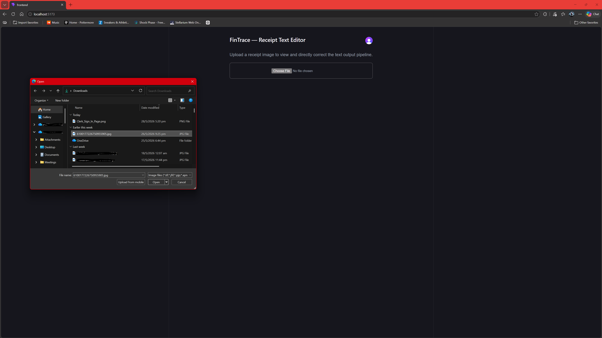
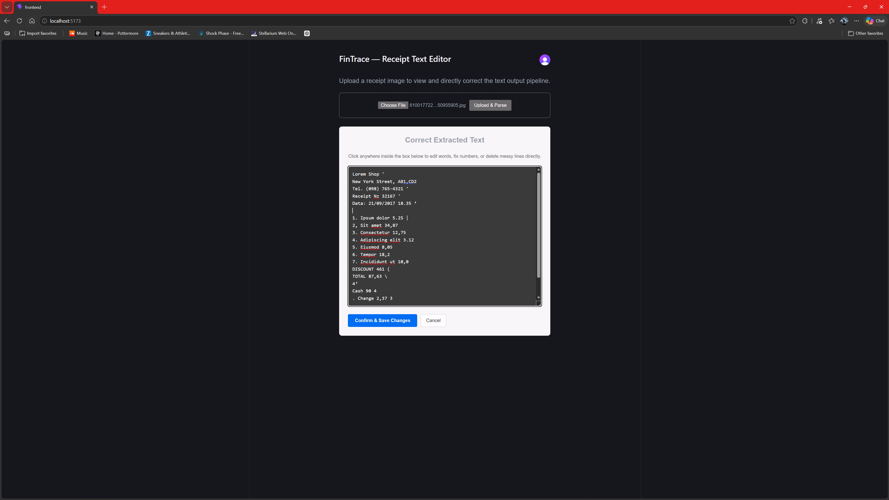
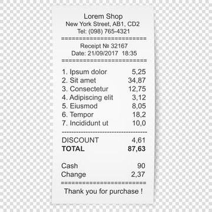
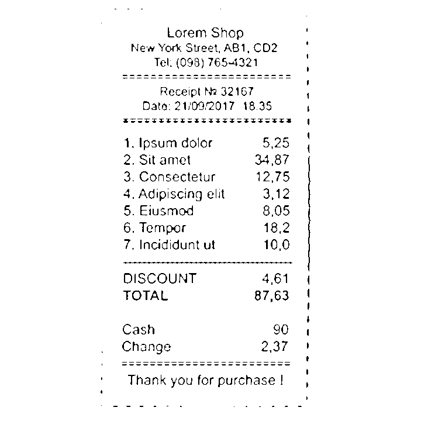

# FinTrace — Receipt Intelligence Web Application

**Team:** FinTrace  
**Members:** Pranav Jagatheeswaran (A0325298U) · Euan Luke Tan (A0325322R)  
**Proposed Level of Achievement:** Apollo 11  
**Programme:** NUS Orbital 2026  

[](https://github.com/PranavJ-960/FinTrace-Orbital)
[](https://github.com/PranavJ-960/FinTrace-Orbital)

---

# Table of Contents

1. [Motivation](#1-motivation)
2. [Aim](#2-aim)
3. [User Stories](#3-user-stories)
4. [Features](#4-features)
5. [Tech Stack](#5-tech-stack)
6. [Software Engineering Practices](#6-software-engineering-practices)
7. [Setup & Installation](#7-setup--installation)
8. [Milestone 1 — Proof of Concept](#8-milestone-1--proof-of-concept)
9. [Development Plan & Timeline](#9-development-plan--timeline)
10. [Project Log](#10-project-log)

---

# 1. Motivation

Many students and young adults in Singapore accumulate receipts from hawker centres, supermarkets, and retail stores without ever understanding where their money goes. As university students approaching financial independence, managing day-to-day expenses is a skill we are still developing. However, most of us lack a clear and consistent way to track spending.

Existing personal finance applications often require manual entry, are designed primarily for Western markets (e.g. Mint, YNAB), or are too complex for first-time users. These barriers discourage consistent usage.

Singapore-specific spending contexts — hawker stalls, NTUC FairPrice, Kopitiam — are not well handled by generic applications. Item names are often abbreviated or in a mix of English and other languages, and receipt formats vary greatly between vendors.

We aim to build **FinTrace**, a receipt intelligence web application that allows users to upload a photo of a receipt and automatically extract, categorise, and analyse their spending. Our system combines OCR, image preprocessing, rule-based processing, and an intelligent categorisation layer to deliver accurate and practical financial insights tailored to Singapore users.

---

# 2. Aim

We aim to design and implement an end-to-end receipt intelligence system that:

- Extracts text from receipt images using OCR supported by custom image preprocessing
- Parses line items and prices into structured data
- Categorises items intelligently into meaningful spending categories
- Builds a personal spending dashboard with interactive visualisations
- Detects unusual spending patterns using statistical methods
- Provides a fallback mechanism for manual data entry and correction

The system emphasises robustness, usability, and real-world applicability for Singapore users.

---

# 3. User Stories

| # | As a… | I want to… | So that… |
|---|---|---|---|
| 1 | Student who wants to track spending without manual entry | Upload a receipt photo | The system automatically extracts and categorises my purchases |
| 2 | User who wants to understand my habits | View a monthly dashboard | I can see my spending breakdown across categories (Food, Transport, Groceries, etc.) |
| 3 | User reviewing my finances | Receive alerts for unusual spending | I can identify anomalies early |
| 4 | User splitting expenses with friends | Assign receipt items to individuals | Costs can be shared fairly |
| 5 | User reflecting on my financial behaviour | View a monthly summary of my spending patterns | I can make better budgeting decisions |
| 6 | User encountering inaccurate OCR results | Manually input or edit expenses | I can still track my spending accurately |

---

# 4. Features

## 4.1 Core Features (Milestone 1–2)

### Feature 1 — Receipt Upload & Image Preprocessing ✅ (Milestone 1)

Users upload receipt images via the React frontend. The backend applies an **OpenCV preprocessing pipeline** before passing the image to Tesseract OCR:

1. **Scaling (2×)** — upscales the image so character height meets Tesseract's optimal recognition threshold
2. **Grayscale conversion** — reduces colour noise
3. **Bilateral filtering** — smooths noise while preserving text edges
4. **Adaptive thresholding** — binarises the image to improve contrast between text and background
5. **Morphological dilation** — reconnects fragmented strokes on thin thermal receipt text


This pipeline is critical for real-world receipt quality, where photos are taken at angles, under fluorescent lighting, or on crumpled thermal paper.

---

### Feature 2 — Item Extraction & Text Parsing (Milestone 2)

A robust rule-based parser implemented in the backend extracts structured line items from raw OCR text. Key behaviours:

- Price detection: uses a regex to find price tokens (supports `$`, commas, and `.` decimals) and converts to numeric prices.
- Line filtering: heuristics and skip-keywords remove headers, totals, tax lines, payment method lines, and other non-item lines.
- Name extraction: trims quantity/leading numbers and trailing punctuation to isolate the item name left of the matched price.
- Zero/invalid price handling: ignores lines where price parses to 0.00 or cannot be parsed.
- Fallback queue: item names with insufficient lexical coverage are routed to the LLM fallback for classification.

Endpoint:

- `POST /api/parse` — accepts `{ raw_text: string }` and returns `{ items: [{ name, price, category, raw_line }], item_count, estimated_total }`.

---

### Feature 3 — Item Categorisation Pipeline (Milestone 2)

Categorisation is a hybrid multi-layer pipeline to maximise accuracy on noisy receipt text:

- Merchant keyword rules: immediate overrides for well-known merchants (e.g. `starbucks`, `fairprice`, `grab`) map directly to categories.
- TF-IDF + Naive Bayes classifier: trained at backend startup from the repository `TRAINING_DATA`; used when the name contains known vocabulary.
- Confidence gating: low-confidence classifier outputs (below a defined threshold) are labelled `LLM_FALLBACK` and queued for resolution.
- LLM fallback: unresolved items are batched and sent to Google Gemini (`resolve_llm_fallback`) to get deterministic category suggestions, returned in the same input order.
- User feedback loop: corrected categories saved via the frontend save flow feed into future training / manual auditing.

Supported categories include: `Food & Beverage`, `Groceries`, `Transport`, `Healthcare`, `Entertainment`, `Utilities`, `Shopping`, `Personal Care`, `Education`, `Other`.

---

### Feature 4 — Spending Dashboard (Milestone 2)

The frontend provides an interactive `SpendingDashboard` component that visualises saved receipt data per user using Recharts. Key points:

- Data source: calls `GET /api/spending-summary?user_id=<id>&months=6` to retrieve aggregated totals, monthly breakdowns and available categories.
- Response schema:

  ```json
  {
    "totals": { "overall": 123.45, "by_category": { "Food & Beverage": 60.50, "Transport": 20.00 } },
    "monthly": [ { "month": "2026-06", "total": 50.00, "by_category": { "Food & Beverage": 30.00 } }, ... ],
    "categories": ["Food & Beverage", "Groceries", ...]
  }
  ```

- Visualisations: pie chart for category share, stacked/line chart for monthly trends, and top-category stats.
- Behaviour: shows placeholder text when no receipts exist and requires authentication to fetch user-specific summaries.

---

### Feature 5 — User Accounts & Receipt History ✅

JWT-based authentication via Clerk enables secure sign-in and receipt history tracking.
A PostgreSQL backend stores corrected receipt text, parsed line items, and categorised spending data.
API endpoints now support saving receipts (`POST /api/save`), retrieving user history (`GET /api/receipts`), and generating spending summaries (`GET /api/spending-summary`).

---

### Feature 6 — Manual Entry & Correction Interface ✅

Users can manually edit OCR results when extraction is inaccurate.

Current implementation includes:

- Editable text area
- Item correction
- Save confirmation flow

---

## 4.2 Extension Features (Milestone 3)

### Feature 7 — Statistical Anomaly Detection

Detect unusual spending behaviour using statistical analysis such as z-scores and deviations from historical averages.

### Feature 8 — Receipt Splitting

Split receipt costs fairly across multiple individuals.

### Feature 9 — Financial Fingerprint Report

Generate monthly personalised financial summaries and insights.

---

# 5. Tech Stack

| Layer | Technology | Justification |
|---|---|---|
| Frontend | React (TypeScript) | Component-based UI with strong typing |
| Charts | Recharts | Declarative charting for React |
| Auth | Clerk | JWT and OAuth management |
| Backend | FastAPI (Python) | Async API framework |
| OCR | Tesseract | Open-source OCR engine |
| Image Processing | OpenCV | Advanced preprocessing |
| Categorisation | Rule-based + LLM | Hybrid intelligent classification |
| Database | PostgreSQL + SQLAlchemy | Structured relational storage |
| Testing | pytest + Jest | Standard testing ecosystem |
| Deployment | Docker + Render/Railway | Reproducible deployment |
| Version Control | Git + GitHub Projects | GitFlow collaboration |

---

# 6. Software Engineering Practices

## 6.1 System Architecture

FinTrace adopts a **three-tier client-server architecture**:

| Tier | Technology | Role |
|---|---|---|
| Presentation | React (TypeScript) SPA | User interface, state management, routing |
| Application | FastAPI (Python) | Business logic, OCR pipeline, REST API |
| Data | PostgreSQL + SQLAlchemy | Persistent storage, ORM modelling |

The frontend and backend communicate exclusively over REST/JSON, keeping the two layers independently deployable and testable.

Within the **FastAPI backend**, we apply an MVC-like separation of concerns:

```text
backend/
├── models/       # SQLAlchemy ORM definitions (Model)
├── services/     # Business logic — OCR, parsing, categorisation (Controller)
└── schemas/      # Pydantic response/request shapes (View contract)
```

This separation ensures that OCR processing logic, database models, and API response shapes remain independently maintainable as the system grows.

---

## 6.2 Testing Strategy

### Backend Testing

Using `pytest`:

- OCR preprocessing tests
- Price extraction tests
- Category matching tests

### Frontend Testing

Using `Jest` + React Testing Library:

- Upload button interactions
- Editable textarea state propagation

### Integration Testing

Test full receipt upload → OCR → API response pipeline.

---

## 6.3 Version Control & Collaboration

We adopt a GitFlow workflow.

Practices include:

- Pull requests with peer review
- Conventional Commits
- GitHub Projects Kanban board

---

# 7. Setup & Installation

## Prerequisites

- Node.js ≥ 18
- Python ≥ 3.10
- PostgreSQL
- Tesseract OCR

### Install Tesseract

#### Windows
https://github.com/UB-Mannheim/tesseract/wiki

#### macOS
```bash
brew install tesseract
```

#### Linux
```bash
sudo apt install tesseract-ocr
```

---

## Backend Setup

```bash
# Clone repository
git clone https://github.com/PranavJ-960/FinTrace-Orbital.git

cd fintrace/backend

# Create virtual environment
python -m venv venv

# Activate virtual environment
source venv/bin/activate        # macOS/Linux
venv\Scripts\activate           # Windows

# Install dependencies
pip install fastapi uvicorn python-multipart opencv-python pytesseract numpy

# Run backend server
uvicorn main:app --reload

# Press Ctrl+C to stop the backend server.
```

API available at:

```text
http://127.0.0.1:8000
```

Swagger docs:

```text
http://127.0.0.1:8000/docs
```

---

## Frontend Setup

```bash
cd fintrace/frontend

# Install dependencies
npm install

# Create environment file
echo "VITE_CLERK_PUBLISHABLE_KEY=your_key_here" > .env.local

# Run frontend
npm run dev

# Press Ctrl+C to stop the frontend server.
```

Frontend available at:

```text
http://localhost:5173
```

---

# 8. Milestone 2 — Proof of Concept

## 8.0 Application Walkthrough

### Step 1 — Sign In


### Step 2 — Upload Receipt


### Step 3 — Review & Correct OCR Output


## 8.1 What Was Built

Milestone 2 demonstrates a fully integrated frontend + backend proof of concept covering:

| Component | Status | Details |
|---|---|---|
| User Authentication | ✅ Complete | Clerk sign-in/sign-up with JWT sessions |
| Image Upload UI | ✅ Complete | React file input with upload trigger |
| OCR Backend Endpoint | ✅ Complete | `POST /api/upload` returns extracted text |
| OpenCV Preprocessing | ✅ Complete | Scaling, bilateral filtering, adaptive thresholding, dilation |
| Manual Text Correction | ✅ Complete | Editable textarea with save flow |
| Database Persistence | ✅ Complete | PostgreSQL persistence with receipt save & query APIs |
| Item Parsing | ✅ Complete | Structured extraction and categorisation pipeline |
| Dashboard Analytics | ✅ Complete | Recharts spending summary and history views |

Notes:
- The backend parser extracts line items and prices using regex/heuristics and routes low-confidence names to an LLM fallback (Gemini).
- Categorisation uses merchant keyword rules, a trained TF-IDF + Naive Bayes model, and an LLM fallback for ambiguous items.
- Saved receipts persist `raw_text` and `parsed_items` (JSONB) in PostgreSQL and can be queried via the history API.
- The frontend includes a `SpendingDashboard` component that fetches `/api/spending-summary` to render charts.

---

## 8.2 Backend Architecture — `main.py`

The backend is implemented using **FastAPI** and acts as the controller layer of the application. It is responsible for:

- Receiving uploaded receipt images
- Applying OpenCV preprocessing
- Running OCR using Tesseract
- Returning extracted text as JSON to the frontend

---

### Backend Imports

```python
import cv2
import numpy as np
import pytesseract
from fastapi import FastAPI, File, UploadFile, HTTPException
from fastapi.middleware.cors import CORSMiddleware
```

### Explanation

| Import | Purpose |
|---|---|
| `cv2` | OpenCV library used for image preprocessing |
| `numpy` | Handles image arrays and byte conversion |
| `pytesseract` | Python wrapper around the Tesseract OCR engine |
| `FastAPI` | Backend API framework |
| `UploadFile` | Handles uploaded receipt image files |
| `HTTPException` | Returns proper API error messages |
| `CORSMiddleware` | Allows frontend and backend communication |

---

### Tesseract OCR Configuration

```python
pytesseract.pytesseract.tesseract_cmd = r'C:\Program Files\Tesseract-OCR\tesseract.exe'
```

This specifies the local installation path of the Tesseract OCR engine on Windows.

Tesseract is responsible for converting processed receipt images into machine-readable text.

---

### FastAPI Application Setup

```python
app = FastAPI(title="FinTrace API")
```

Creates the FastAPI backend instance.

FastAPI automatically generates:
- Swagger API documentation at `/docs`
- OpenAPI schema generation
- Typed request validation

---

### CORS Middleware

```python
app.add_middleware(
    CORSMiddleware,
    allow_origins=["http://localhost:5173", "http://127.0.0.1:5173"],
    allow_credentials=True,
    allow_methods=["*"],
    allow_headers=["*"],
)
```

The frontend and backend run on different local ports during development:

| Service | Port |
|---|---|
| React Frontend | `5173` |
| FastAPI Backend | `8000` |

Browsers normally block cross-origin requests for security reasons.

`CORSMiddleware` explicitly allows the React frontend to communicate with the FastAPI backend during development.

---

## 8.3 OCR Preprocessing Pipeline

### `preprocess_image()`

```python
def preprocess_image(image: np.ndarray) -> np.ndarray:
```

This function applies a multi-stage OpenCV preprocessing pipeline before OCR.

The goal is to improve OCR accuracy on:
- Blurry receipts
- Low lighting
- Thermal paper
- Small fonts
- Uneven shadows

---

### Step 1 — Image Scaling

```python
image = cv2.resize(
    image,
    None,
    fx=2,
    fy=2,
    interpolation=cv2.INTER_CUBIC
)
```

The receipt image is enlarged by 2× using cubic interpolation.

#### Why?


Tesseract performs optimally when lowercase character height is approximately 20–30 pixels. Receipt photos taken on mobile devices often render text significantly below this threshold. Upscaling by 2× brings character height into Tesseract's reliable recognition range.

`INTER_CUBIC` preserves text edges better than simple nearest-neighbour scaling, reducing interpolation artefacts on character boundaries.

---

### Step 2 — Grayscale Conversion

```python
gray = cv2.cvtColor(image, cv2.COLOR_BGR2GRAY)
```

Converts the receipt image into grayscale.

#### Why?

OCR does not require colour information.

Removing colour:
- Reduces computational complexity
- Removes colour noise
- Simplifies thresholding

---

### Step 3 — Bilateral Filtering

```python
filtered = cv2.bilateralFilter(gray, 9, 75, 75)
```

Applies bilateral filtering to smooth noise while preserving edges.

#### Why?

Unlike Gaussian blur, bilateral filtering:
- Removes background noise
- Keeps text edges sharp
- Preserves character boundaries

This is important because blurry text significantly reduces OCR accuracy.

---

### Step 4 — Adaptive Thresholding

```python
thresh = cv2.adaptiveThreshold(
    filtered,
    255,
    cv2.ADAPTIVE_THRESH_GAUSSIAN_C,
    cv2.THRESH_BINARY,
    15,
    8
)
```

Converts the image into black-and-white binary text regions.

#### Why?

Receipt photos often contain:
- Uneven lighting
- Shadows
- Glare
- Faded thermal printing

Adaptive thresholding computes local thresholds for different image regions, improving contrast between text and background.

`ADAPTIVE_THRESH_GAUSSIAN_C` uses weighted local neighbourhoods for better robustness.

---

### Step 5 — Morphological Dilation

```python
kernel = np.ones((2, 2), np.uint8)
processed = cv2.dilate(thresh, kernel, iterations=1)
```

Thickens thin characters using morphological dilation.

#### Why?

Thermal receipts often produce:
- Broken characters
- Thin strokes
- Incomplete digits

Dilation reconnects fragmented text strokes so Tesseract recognises them as continuous characters.

---

### Preprocessing Example

**Before**



**After**



---

## 8.4 OCR Extraction Endpoint

### Receipt Upload API

```python
@app.post("/api/upload")
async def upload_receipt(file: UploadFile = File(...)):
```

Creates a POST endpoint that accepts uploaded receipt images.

The frontend sends:
- `multipart/form-data`
- Image bytes

The backend processes the image and returns extracted OCR text.

---

### File Validation

```python
if not file.content_type.startswith("image/"):
    raise HTTPException(
        status_code=400,
        detail="Uploaded file must be an image."
    )
```

Rejects non-image uploads to prevent invalid processing.

---

### Reading Image Bytes

```python
contents = await file.read()
nparr = np.frombuffer(contents, np.uint8)
image = cv2.imdecode(nparr, cv2.IMREAD_COLOR)
```

#### Explanation

| Operation | Purpose |
|---|---|
| `file.read()` | Reads uploaded image bytes |
| `np.frombuffer()` | Converts raw bytes into NumPy array |
| `cv2.imdecode()` | Converts array into OpenCV image matrix |

---

### OCR Execution

```python
processed = preprocess_image(image)

custom_config = r'--psm 6'

raw_text = pytesseract.image_to_string(
    processed,
    config=custom_config
)
```

#### Tesseract Configuration

`--psm 6` stands for:

> Assume a single uniform block of text.

This mode works well for receipt layouts because receipts are generally vertically structured text blocks.

---

### API Response

```python
return {"text": raw_text}
```

The backend returns OCR output as JSON.

Example response:

```json
{
  "text": "APPLE JUICE 2.50\nBREAD 1.80\nTOTAL 4.30"
}
```

---

## 8.5 Frontend Architecture — `App.tsx`

The frontend is built using:
- React
- TypeScript
- Clerk Authentication

It provides:
- Secure authentication
- Receipt image uploads
- OCR display
- Direct manual editing of extracted text

---

### State Management

```typescript
const [selectedFile, setSelectedFile] = useState<File | null>(null);
const [loading, setLoading] = useState<boolean>(false);
const [receipt, setReceipt] = useState<ReceiptData | null>(null);
const [isEditing, setIsEditing] = useState<boolean>(false);
```

#### Explanation

| State Variable | Purpose |
|---|---|
| `selectedFile` | Stores uploaded receipt image |
| `loading` | Tracks OCR processing state |
| `receipt` | Stores extracted OCR text |
| `isEditing` | Controls editable textarea visibility |

---

## 8.6 Clerk Authentication Integration

### Signed-Out View

```tsx
<SignedOut>
  <SignIn routing="hash" />
</SignedOut>
```

Unauthenticated users see the Clerk sign-in page.

---

### Signed-In View

```tsx
<SignedIn>
  <UserButton />
</SignedIn>
```

Authenticated users gain access to:
- Receipt upload system
- OCR editor
- Future dashboard features

`<UserButton />` provides:
- User profile access
- Sign-out functionality

---

## 8.7 Receipt Upload Flow

### File Selection

```tsx
<input
  type="file"
  accept="image/*"
  onChange={handleFileChange}
/>
```

Allows users to upload:
- JPG
- PNG
- Receipt image formats

---

### Upload Request

```typescript
const formData = new FormData();
formData.append('file', selectedFile);
```

Creates multipart form data for image upload.

---

### Sending Request to Backend

```typescript
const response = await fetch(
  'http://127.0.0.1:8000/api/upload',
  {
    method: 'POST',
    body: formData,
  }
);
```

The frontend sends the receipt image to the FastAPI OCR endpoint.

---

### Parsing OCR Response

```typescript
const data = await response.json();

const extractedText =
  data.text ||
  (typeof data === 'string'
    ? data
    : JSON.stringify(data, null, 2));
```

Extracted OCR text is parsed from the backend JSON response and stored in React state.

---

## 8.8 Manual OCR Correction Interface

### Editable Textarea

```tsx
<textarea
  rows={18}
  value={receipt.rawText}
  onChange={(e) =>
    setReceipt({ rawText: e.target.value })
  }
/>
```

Users can directly:
- Correct OCR mistakes
- Fix prices
- Remove noisy lines
- Edit extracted receipt text

This provides robustness when OCR accuracy is imperfect.


---

### Save Flow

```typescript
const handleSave = async () => {
  if (!receipt) return;

  try {
    // Milestone 2: This will push the manually cleaned text block to PostgreSQL
    console.log('Saving cleaned raw text to database:', receipt.rawText);
    alert('Receipt text updated and saved successfully!');
    setIsEditing(false);
  } catch (error) {
    console.error('Error saving receipt:', error);
  }
};
```


Currently:
- Logs cleaned text to console

Planned for Milestone 2:
- Save corrected receipt data into PostgreSQL
- Feed corrections into categorisation pipeline

---

## 8.9 Item Extraction & Text Parsing (Proof of Concept — Milestone 2)

A backend parser extracts structured items from the raw OCR text and exposes a parse endpoint for the frontend.

Key behaviours:

- Price detection uses a tolerant regex accepting formats like `$1.23`, `1.23`, `1,234.56` and normalises to float.
- Non-item lines (totals, payment methods, membership lines) are filtered via a skip-keyword list.
- Item names are trimmed of leading quantities and trailing punctuation before categorisation.
- Low-coverage names are queued for LLM-assisted classification.

Endpoint:

- `POST /api/parse` — request: `{ "raw_text": "..." }`
- response: `{ "items": [ { "name": "APPLE JUICE", "price": 2.5, "category": "Food & Beverage", "raw_line": "APPLE JUICE 2.50" }, ... ], "item_count": N, "estimated_total": 12.34 }`

---

## 8.10 Item Categorisation Pipeline (Proof of Concept — Milestone 2)

Categorisation is implemented as a multi-layer pipeline to handle noisy, short, or ambiguous names.

Pipeline layers:

- Merchant keyword rules: quick deterministic mapping for well-known merchants (e.g. `starbucks` → `Food & Beverage`, `fairprice` → `Groceries`).
- TF-IDF + Naive Bayes classifier: trained at backend startup from `TRAINING_DATA` (vectoriser + `MultinomialNB`) for general-purpose classification.
- Confidence gating: classifier outputs under a set threshold are marked `LLM_FALLBACK` and routed to the LLM resolver.
- LLM (Gemini) fallback: batched unresolved names are sent to Gemini for deterministic category assignments returned in input order.

Behavioural notes:

- The pipeline prints debug routing for `Rule Hit`, `ML Hit`, and `ML Low Confidence` events during processing.
- Supported categories include `Food & Beverage`, `Groceries`, `Transport`, `Healthcare`, `Entertainment`, `Utilities`, `Shopping`, `Personal Care`, `Education`, `Other`.

---

## 8.11 Receipt History & Persistence (Proof of Concept — Milestone 2)

Receipts (raw OCR + parsed items) persist to PostgreSQL and are queryable per user.

Database schema (simplified):

- `receipts` table columns: `id SERIAL PRIMARY KEY`, `user_id TEXT`, `raw_text TEXT`, `parsed_items JSONB`, `created_at TIMESTAMP DEFAULT NOW()`

Endpoints:

- `POST /api/save` — body: `{ "user_id": "<id>", "raw_text": "...", "parsed_items": [ ... ] }` → returns `{ "success": true, "receipt_id": <id> }` on success.
- `GET /api/receipts?user_id=<id>` — returns `{"receipts": [ { "id": 1, "raw_text": "...", "parsed_items": [...], "created_at": "..." }, ... ] }`.
- `GET /api/spending-summary?user_id=<id>&months=6` — returns aggregated `totals`, `monthly` series and `categories` useful for dashboard visualisations.

Notes:

- `parsed_items` are stored as JSONB to allow efficient JSON queries and aggregation in SQL for the spending summary.
- The backend includes SQL to aggregate monthly totals per category and overall totals used by the dashboard.

---

## 8.12 Spending Dashboard (Proof of Concept — Milestone 2)

The frontend `SpendingDashboard` component renders user-specific spending analytics using Recharts.

Key behaviours:

- Fetches `/api/spending-summary?user_id=<id>&months=6` and renders:
  - Pie chart for category share (current period)
  - Line/stacked chart for monthly breakdown by category
  - Top-category stat and overall total
- Shows placeholders when no receipts are present and requires authentication to access user data.
- Response schema example:

```json
{
  "totals": { "overall": 123.45, "by_category": { "Food & Beverage": 60.50, "Transport": 20.00 } },
  "monthly": [ { "month": "2026-06", "total": 50.00, "by_category": { "Food & Beverage": 30.00 } } ],
  "categories": ["Food & Beverage", "Groceries", "Transport", "Other"]
}
```

---


## 8.9 Application Entry Point — `main.tsx`

```tsx
<ClerkProvider
  publishableKey={PUBLISHABLE_KEY}
  afterSignOutUrl="/"
>
  <App />
</ClerkProvider>
```

`main.tsx` is the root entry point of the React application.

Responsibilities:
- Mount React into the DOM
- Initialise Clerk authentication
- Provide global authentication context

---

### Environment Variables

```typescript
const PUBLISHABLE_KEY =
  import.meta.env.VITE_CLERK_PUBLISHABLE_KEY
```

The Clerk API key is loaded from:

```text
.env.local
```

Example:

```env
VITE_CLERK_PUBLISHABLE_KEY=your_key_here
```

This prevents sensitive credentials from being hardcoded into source files.

---

## 8.10 End-to-End Data Flow

```text
1) Upload & OCR
   - Frontend: `POST /api/upload` (multipart/form-data) with image
   - Backend: OpenCV preprocessing (scale → grayscale → bilateral filter → adaptive threshold → dilation)
   - Backend: Tesseract OCR extracts raw text
   - Response: `{ "text": "...raw OCR text..." }`

2) Parse & Categorise
   - Frontend: optionally display/edit raw text, then `POST /api/parse` with `{ raw_text }`
   - Backend: `parse_receipt_items()` extracts `{ name, price, raw_line }` for each detected item using regex and heuristics
   - Backend: `classify_item_name()` applies merchant rules, TF-IDF + Naive Bayes classifier, confidence gating; low-confidence items are batched to Gemini for deterministic categories
   - Response: `{ "items": [ { name, price, category, raw_line }, ... ], "item_count": N, "estimated_total": 12.34 }`

3) Save & Persist
   - Frontend: user confirms edits and clicks save → `POST /api/save` with `{ user_id, raw_text, parsed_items }`
   - Backend: inserts into `receipts (user_id, raw_text, parsed_items JSONB, created_at)` and returns `receipt_id`

4) History & Dashboard
   - Frontend: fetch history via `GET /api/receipts?user_id=<id>` to populate the History view
   - Dashboard: `GET /api/spending-summary?user_id=<id>&months=6` returns aggregated `totals`, `monthly` series and `categories`
   - Frontend: `SpendingDashboard` uses the summary payload to render Recharts visualisations (pie, stacked/line charts)

5) Feedback Loop
   - User corrections to categories/items are saved with the receipt and available for manual review or retraining of the TF-IDF classifier.

This pipeline provides the full Milestone 2 flow: image → OCR → parse → categorise → persist → visualise.
```

---

## 8.11 Problems Encountered

### OCR Accuracy on Thermal Receipts
Thermal paper produces low-contrast faded text. Early pipeline versions using global thresholding failed on these. Switching to `ADAPTIVE_THRESH_GAUSSIAN_C` resolved uneven lighting issues.

### CORS in Local Development
Initial fetch calls from React to FastAPI were blocked by the browser. Resolved by configuring `CORSMiddleware` with explicit origin allowlisting.

---

# 9. Development Plan & Timeline

## Milestone 2 — Completed

- [x] Rule-based parser
- [x] Categorisation pipeline
- [x] Dashboard visualisations
- [x] PostgreSQL integration
- [x] Receipt history API

---

## Milestone 3

- [ ] Anomaly detection
- [ ] Receipt splitting
- [ ] Financial fingerprint reports
- [ ] Receipt splitting
- [ ] Report generation
- [ ] Financial fingerprint reports
- [ ] User testing
- [ ] Docker deployment

---

# 10. Project Log

Full task-by-task project log with dates and hours is maintained here:

[FinTrace Project Log — Google Sheets](https://docs.google.com/spreadsheets/d/19o-82zqusLOTXPOMhEbv3fp2qDXGYndIJxKAq4dviGc/edit?usp=sharing)

---

*FinTrace — NUS Orbital 2026*